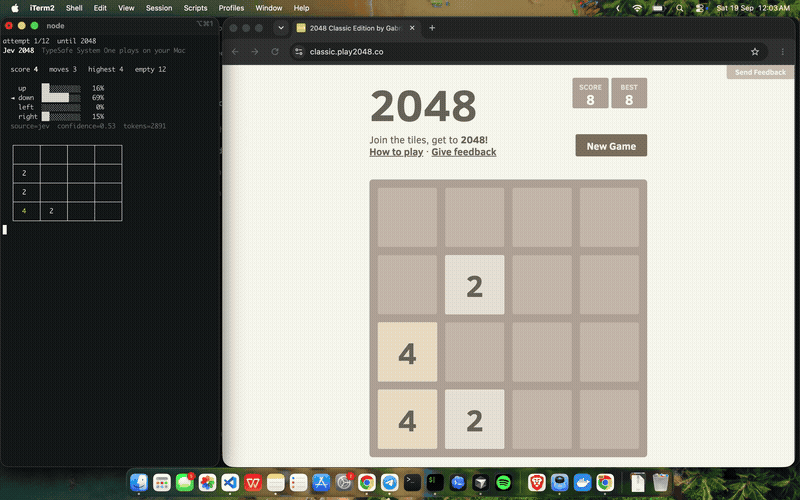

# Jev 2048

[TypeSafe Jev](https://typesafe.ai) playing live 2048. Jev does not see pixels and does not write text. Playwright reads the board, Jev picks a swipe, the browser presses the arrow key.



## How it works

1. Playwright opens [classic.play2048.co](https://classic.play2048.co/) (the original Cirulli game).
2. The board is read from `localStorage.gameState` — not from screenshots.
3. Jev returns `up` / `down` / `left` / `right` over **legal** moves, with probabilities.
4. Playwright presses that arrow key.
5. Repeat.

`https://play2048.co/` is a canvas rebuild, so this project uses the official classic edition.

## Run

```bash
cp .env.example .env   # paste TYPESAFE_API_KEY from https://console.typesafe.ai/settings/keys
uv sync
uv run playwright install chromium
uv run jev-2048
```

A Chromium window opens on classic 2048. The terminal shows every pick. Ctrl+C stops.

```bash
uv run jev-2048 --demo            # local heuristic, no API key
uv run jev-2048 --no-hud          # real site only, decisions stay in the terminal
uv run jev-2048 --max-moves 30
uv run jev-2048 --terminal        # in-process board, no website
```

## Cost

Jev is $0.042 per million input tokens. Output is free. One move is a few hundred tokens. If only one swipe is legal, the API is skipped.

## License

MIT
